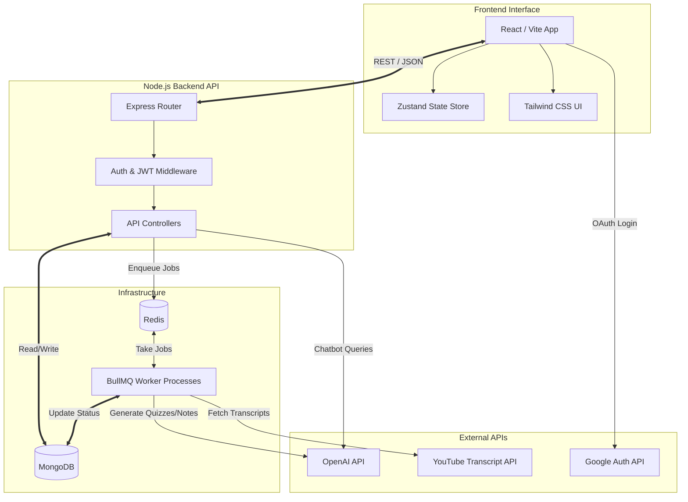
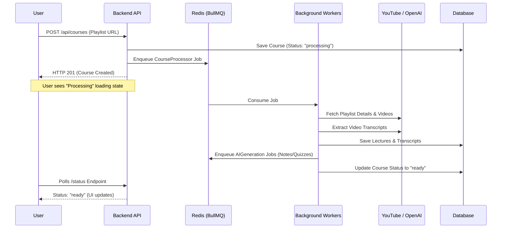

# QuestXP 🎮

> **Learning platform first, game second.** QuestXP turns any YouTube playlist into a structured, gamified course — with XP, streaks, AI-generated notes, interactive quizzes, and a contextual Doubt Chatbot.

**Built by Parth Patidar**

---

## 🌟 Core Features

- **📺 YouTube to Course Conversion:** Paste any YouTube playlist link and QuestXP automatically extracts lecture metadata, thumbnails, and transcripts to build a structured curriculum.
- **🏆 Deep Gamification Engine:** Earn XP for watching lectures, completing quizzes, and maintaining daily streaks. Level up to unlock new platform features (like the AI Chatbot and Study Plans).
- **📝 AI-Generated Study Materials:** Automatically generates concise summaries, key takeaways, and practice quizzes from lecture transcripts using OpenAI GPT models.
- **🤖 Contextual Doubt Chatbot:** An integrated AI tutor that understands exactly which course and lecture you are currently watching to provide highly relevant answers.
- **📅 Smart Study Planner:** Generates an adaptive learning schedule based on your weekly availability and course length.

---

## 🛠️ Technical Architecture

QuestXP is built on a modern, robust, and scalable stack designed to handle heavy background processing for AI generations and transcript extraction.

### Tech Stack

| Layer | Technology |
|-------|------------|
| **Frontend** | React 18, Vite, Tailwind CSS (Esports Theme), Framer Motion, Zustand |
| **Backend** | Node.js, Express.js |
| **Database** | MongoDB (Mongoose ODM) |
| **Queue / Cache** | Redis, BullMQ |
| **Authentication**| JWT (HttpOnly cookies), Google OAuth 2.0 |
| **AI & APIs** | OpenAI (GPT-4o-mini, text-embeddings), `youtube-transcript` |

### System Diagram



---

## 🚀 How It Works (The Course Processing Pipeline)

Because extracting transcripts and generating AI content takes time, QuestXP utilizes an asynchronous event-driven architecture.



---

## 🎮 Gamification Mechanics

The entire learning experience revolves around progression and rewards. 

| Action | XP Reward |
|---------|----|
| Start a lecture | `+5 XP` |
| Complete a lecture (≥ 80% watched) | `+30 XP` |
| Maintain a daily streak | `+20 XP` |
| Pass a practice quiz | `+40 XP` |
| Ace a practice quiz (100%) | `+75 XP` |
| Meet daily UI goal | `+50 XP` |

**Feature Gating System:**
- Users start at **Level 1**.
- **Level 2** unlocks the AI Doubt Chatbot.
- **Level 3** unlocks AI Practice Quizzes.
- **Level 4** unlocks the Adaptive Study Planner.

---

## 💻 Local Development Setup

### 1. Prerequisites
- **Node.js** (v18+)
- **MongoDB** (Local instance or MongoDB Atlas)
- **Redis** (Local instance or Upstash)
- **API Keys**: OpenAI API Key, Google OAuth Client ID & Secret.

### 2. Installation

Clone the repository and install dependencies for both ends:

```bash
git clone https://github.com/parthpatidar03/QuestXP.git
cd QuestXP

# Install Backend
cd backend && npm install

# Install Frontend
cd ../frontend && npm install
```

### 3. Environment Variables

**Backend (`backend/.env`):**
```env
PORT=5000
MONGODB_URI=mongodb://localhost:27017/questxp
JWT_SECRET=your_super_secret_jwt_key
REDIS_URL=redis://localhost:6379

GOOGLE_CLIENT_ID=your_google_client_id
GOOGLE_CLIENT_SECRET=your_google_client_secret

OPENAI_API_KEY=your_openai_api_key
FRONTEND_URL=http://localhost:5173
```

**Frontend (`frontend/.env`):**
```env
VITE_API_URL=http://localhost:5000/api
```

### 4. Running the App

Start the backend server and workers:
```bash
cd backend
npm run dev
```

Start the frontend Vite server:
```bash
cd frontend
npm run dev
```
Open **http://localhost:5173** in your browser.

---

## 📄 License
MIT License. Created by **Parth Patidar**.
