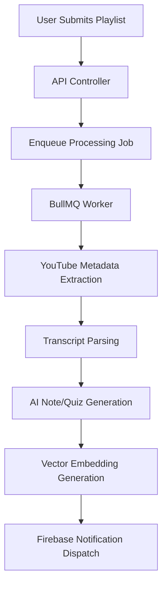

<p align="center">
  
</p>

<h1 align="center">QuestXP</h1>

<p align="center">
  <strong>Advanced Gamified Learning and Productivity Ecosystem</strong>
</p>

<p align="center">
  
  
  
</p>

<p align="center">
  QuestXP transforms static YouTube playlists into structured, high-productivity learning hubs. By integrating advanced AI orchestration, vector-based contextual intelligence, and data-driven productivity metrics, QuestXP bridges the gap between passive content consumption and objective skill mastery.
</p>

---

## Overview

QuestXP is a full-stack learning management system designed to optimize the educational journey. Users convert YouTube playlists into comprehensive curricula featuring AI-generated study assets, interactive assessments, and dynamic scheduling. The platform leverages large language models and vector databases to provide personalized guidance, contextual doubt resolution, and automated progress tracking.

### Live Instance
Access the production environment: [https://quest-xp-beta.vercel.app/](https://quest-xp-beta.vercel.app/)

### 📚 Technical Documentation
- **[Backend Implementation Guide](./IMPLEMENTATION.md)**: Deep dive into the architecture, identity systems, and gamification logic. (Essential for learning/interviews).

---

## Productivity and Learning Analytics

The QuestXP dashboard has been evolved from simple vanity metrics into a professional productivity hub, providing deep insights into learning performance.

### Productivity Dashboard Cards
- **Rank Positioning**: Real-time global ranking and percentile tracking compared to the total learner population.
- **Learning Time Analytics**: Precision tracking of actual study hours, including weekly aggregates and daily average focus time.
- **Milestone Monitoring**: Automated deadline reminders derived from adaptive study plans, prioritizing urgent course targets.
- **Mastery Progression**: Holistic completion rates showing the ratio of mastered courses against total enrollments.

- **Global Rankings**: A competitive leaderboard showcasing top learners based on XP and Level.
- **Privacy-First Identity (Anime-Themed)**: A unique system that auto-generates anime handles (e.g., *ShadowGoku9421*) for users, protecting real identities while allowing full community participation.
- **Flexible Identity Management**: Users can claim or change their global handle anytime from their profile.

---

### Core Capabilities

### Curriculum Orchestration
Convert any YouTube playlist URL into a structured course. The platform extracts metadata and transcripts using background workers to organize lectures into a cohesive educational framework.

### RAG-Powered Doubt Resolution
A contextual chatbot powered by Retrieval-Augmented Generation (RAG) using Pinecone. The system understands specific lecture contexts to provide precise answers, with an automatic fallback to Llama 3.2 via OpenRouter for 100% uptime.

### Surgical Adaptive Study Planning
A dynamic "Google Maps for Learning" scheduling engine. It generates personalized study roadmaps with **Granular +/- Day Controls**. 
- **Missed a Day?** Click `+` on any video to push the rest of the schedule forward.
- **Finished Early?** Click `-` to pull the plan back.
The engine instantly **recalculates** the entire downstream pipeline based on your unique weekend/weekday capacity, keeping goals realistic without the guilt.

### AI-Powered Study Assets
Automated generation of lecture summaries, key takeaways, and interactive quizzes using Gemini 1.5 Flash. Assessments test comprehension at the end of each module to award XP and unlock progression.

---

## Gamification Architecture

QuestXP utilizes a tiered progression system to maintain engagement and incentivize consistency.

| Action | XP Reward |
|--------|-----------|
| Start Lecture | 5 XP |
| Complete Lecture (80%+ Watched) | 30 XP |
| Daily Streak Maintenance | 20 XP |
| Pass Practice Quiz | 40 XP |
| Perfect Quiz Score (100%) | 75 XP |
| Meet Daily Study Goal | 50 XP |

### Feature Unlock Thresholds
- **Level 2**: AI Doubt Chatbot
- **Level 3**: AI-Generated Practice Quizzes
- **Level 4**: Adaptive Study Planner
- **Level 5**: Advanced Productivity Analytics

---

## Technical Stack

### Frontend
- **Framework**: React 18 with Vite
- **Styling**: Tailwind CSS (Custom Glassmorphism Design System)
- **State Management**: Zustand
- **Real-time**: Firebase Cloud Messaging (Notifications)
- **Animations**: Framer Motion
- **Data Fetching**: TanStack Query (React Query)

### Backend
- **Runtime**: Node.js / Express.js
- **Asynchronous Processing**: Redis and BullMQ for background AI tasks
- **Security**: RBAC (Role-Based Access Control), JWT with HttpOnly cookies, and Google OAuth 2.0
- **Communications**: Resend API for transactional email

### Persistence and Intelligence
- **Primary Database**: MongoDB / Mongoose ODM
- **Vector Database**: Pinecone (for RAG context)
- **AI Infrastructure**: Gemini 1.5 Flash (Primary) & OpenRouter / Llama 3.2 (Fallback)
- **Data Sources**: YouTube Data API v3

---

## Infrastructure and Deployment

### Docker Configuration
QuestXP is fully containerized for consistent development and deployment cycles.

1. **Prerequisites**: Docker Desktop, required API Keys.
2. **Setup**: Configure environment variables in `backend/.env` and `frontend/.env`.
3. **Launch**:
   ```bash
   docker-compose up --build -d
   ```

### Event-Driven Pipeline
Course processing follows an asynchronous worker architecture to maintain high API responsiveness during compute-intensive AI operations.


```mermaid
graph TD
    A[User Submits Playlist] --> B[API Controller]
    B --> C[Enqueue Processing Job]
    C --> D[BullMQ Worker]
    D --> E[YouTube Metadata Extraction]
    E --> F[Transcript Parsing]
    F --> G[AI Note/Quiz Generation]
    G --> H[Vector Embedding Generation]
    H --> I[Firebase Notification Dispatch]
```

---

## Installation

For manual configuration:

1. **Dependency Resolution**:
   ```bash
   cd backend && npm install
   cd ../frontend && npm install
   ```

2. **Service Launch**:
   - Ensure local MongoDB and Redis instances are active.
   - Launch services:
     ```bash
     # Backend
     npm run dev
     # Frontend
     npm run dev
     ```

---

## License
MIT License. Developed by Parth Patidar.
