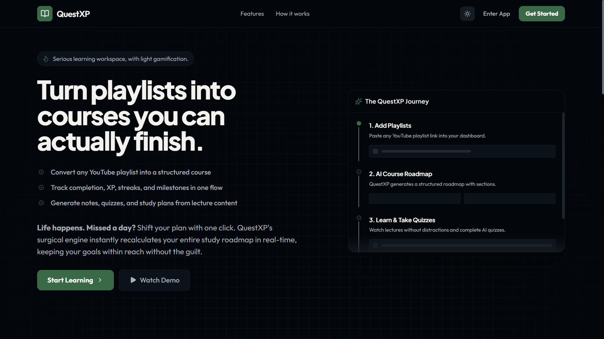
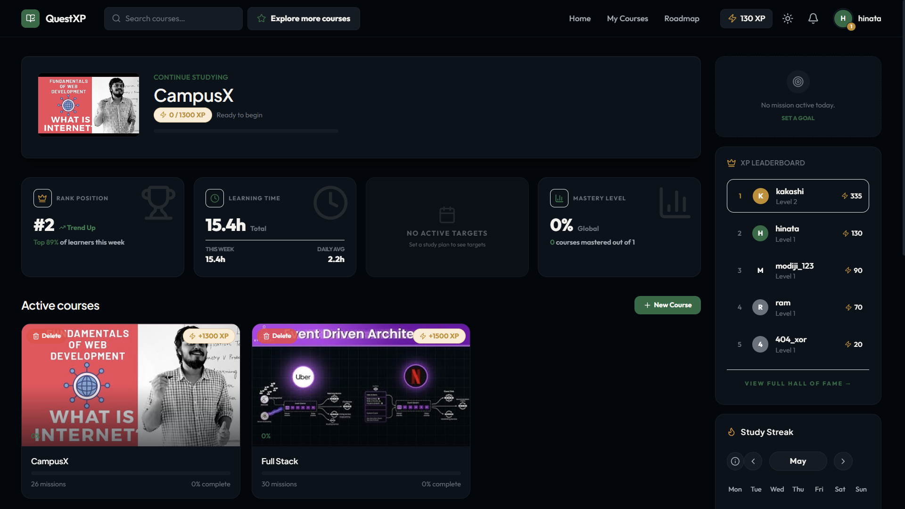
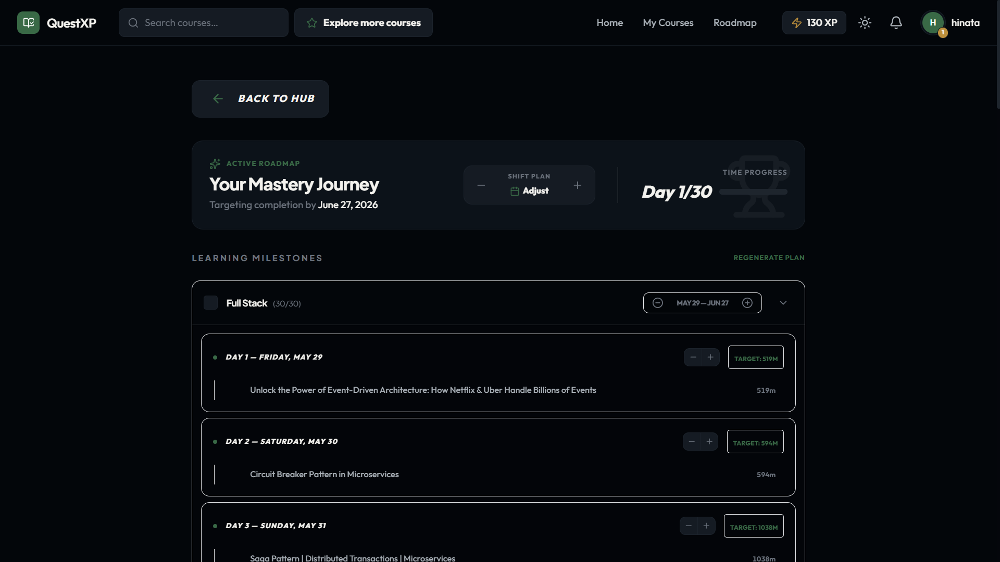
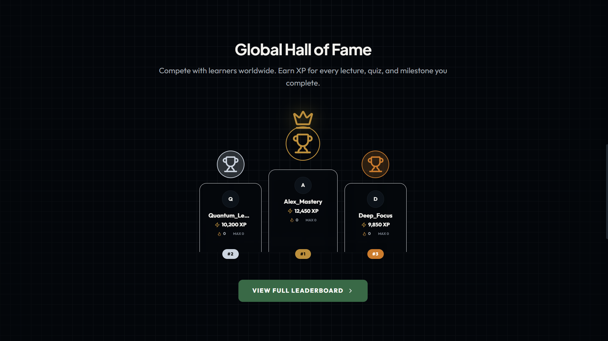
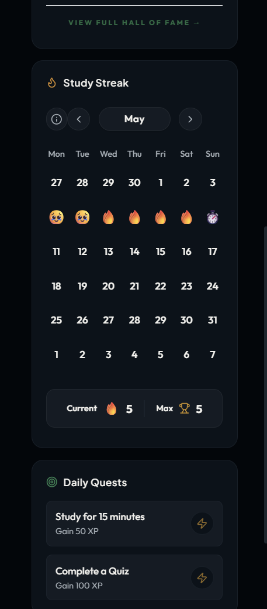
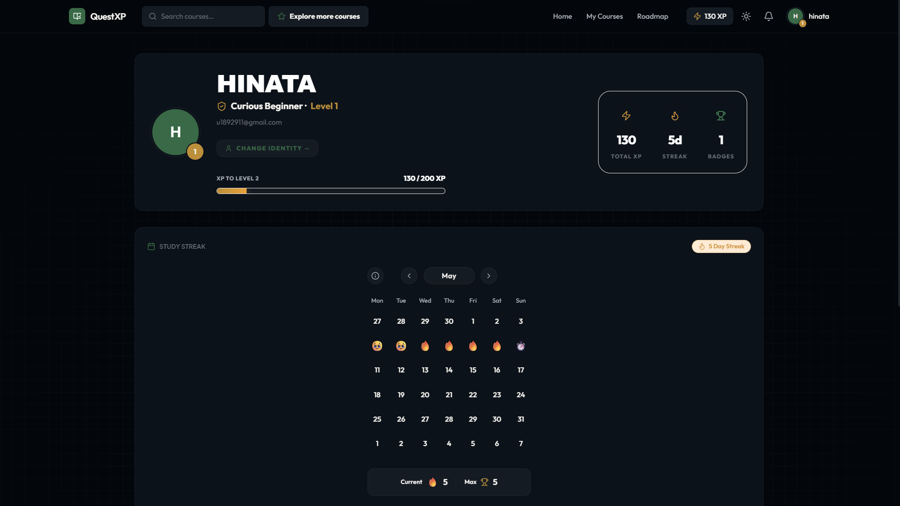

<p align="center">
  <a href="https://quest-xp-beta.vercel.app/">
    
  </a>
</p>

<p align="center">
  
</p>

<h1 align="center">QuestXP</h1>

<p align="center">
  <strong>Advanced Gamified Learning and Productivity Ecosystem</strong>
</p>

<p align="center">
  
  
  
</p>

<p align="center">
  QuestXP is a high-performance Learning Management System (LMS) designed to solve "Playlist Fatigue." It converts unstructured YouTube content into structured curricula using AI orchestration, vector-based RAG, and an adaptive scheduling engine.
</p>

---

## 🏗️ System Architecture

QuestXP utilizes a **Decoupled Monolith** architecture with an **Event-Driven AI Pipeline**.

### Backend (Node.js/Express)
- **Layered Pattern**: Strictly separates `Routes` -> `Middleware` -> `Services` (Business Logic) -> `Controllers` (Request Handling) -> `Models` (Data).
- **Service Layer**: Orchestrates complex domain logic (e.g., recursive course deletion, AI pipeline gating) to keep controllers thin and testable.
- **Identity & Security**: JWT-based authentication with a **Dual-Mode System** supporting both `HttpOnly` cookies and `Authorization: Bearer` headers for maximum reliability in cross-domain and incognito environments.
- **Worker Tier**: BullMQ + Redis cluster for non-blocking execution of compute-intensive AI tasks (Transcription, Summarization).

### Frontend (React/Vite)
- **State Management**: Zustand for global UI/Auth state; TanStack Query for declarative server-state synchronization.
- **Optimistic UI Updates**: High-frequency interactions (e.g., roadmap shifts, progress marking) utilize an "Update-First, Sync-Later" pattern to ensure zero-latency perception.
- **Hook-Based Logic**: Business logic is encapsulated in custom hooks (e.g., `useLectureStatus`) to prevent component bloat and enable auto-cleanup of side effects like polling.
- **Design System**: Atomic-based Tailwind configuration with a custom glassmorphic aesthetic.
- **Performance**: Code-splitting, optimized re-render cycles, and modular component extraction (e.g., `CourseSearch` isolated from `NavBar`).

---

## 📊 Interface Preview

<table style="width: 100%;">
  <tr>
    <td align="center"><b>Landing Page</b></td>
    <td align="center"><b>Productivity Dashboard</b></td>
  </tr>
  <tr>
    <td></td>
    <td></td>
  </tr>
  <tr>
    <td align="center"><b>Adaptive Roadmap</b></td>
    <td align="center"><b>Leaderboard (Hall of Fame)</b></td>
  </tr>
  <tr>
    <td></td>
    <td></td>
  </tr>
  <tr>
    <td align="center"><b>Learning Analytics</b></td>
    <td align="center"><b>Identity Management</b></td>
  </tr>
  <tr>
    <td></td>
    <td></td>
  </tr>
</table>

---

## 🗄️ Database Schema (MongoDB)

### 1. User Model
Core entity for identity and progress tracking.
- `totalXP / level`: Gamification anchors.
- `streak`: Tracks `current`, `longest`, and `lastStudiedDate`.
- `fcmToken`: Firebase token for cross-platform notifications.
- `username`: Anime-themed handle (unique, identity-protected).

### 2. Course Model
The backbone of the curriculum.
- `sections`: Nested array containing `lectures`.
- `aiStatus`: Granular tracking of `transcription`, `notes`, `quiz`, and `embedding` statuses per lecture.
- `topics`: Automated timestamp-based lecture segmentation.

### 3. Progress Model
- Junction collection mapping `User` <-> `Course` <-> `Lecture`.
- Tracks completion percentages and mastery levels.

### 4. Roadmap Model
- Stores calculated study dates for the adaptive planner.
- Enables downstream recalculation without mutating the original Course model.

### 5. Feedback Model
- Persistent storage for user feedback and bug reports.
- Captures `userName`, `userEmail`, `message`, and `contextPage` for granular debugging.

---

## 🧠 Deep Technical Insights

### 1. Surgical Adaptive Roadmap Algorithm
The core innovation of QuestXP is the **Linear Propagation Engine** for study scheduling. Unlike static calendars, this system treats a course as a linked-list of milestones.
- **Propagation Logic**: When a user adjusts a date (e.g., shifts Day 5 forward by +1), the engine triggers a recursive update. All downstream lecture deadlines are recalculated using $O(n)$ complexity.
- **Weekend Awareness**: The algorithm can be configured to respect user-defined "Rest Days," skipping them during propagation to keep the workload realistic.
- **Data Integrity**: Schedule mutations are atomic. If a user completes a lecture early, the engine offers a "Pull Forward" option to compress the remaining timeline.

### 2. Scalable Global Leaderboard
The **Global Hall of Fame** is built for high-concurrency read performance.
- **Ranking Engine**: Calculates user rank based on total XP and Level using a high-performance MongoDB index on `{ totalXP: -1, level: -1 }`.
- **Percentile Tracking**: Dynamically computes where a user stands (e.g., "Top 5% of learners") by comparing their XP against the total user count.
- **Identity Protection**: To ensure privacy in a competitive space, QuestXP uses an **Anime-Themed Alias System**. Users are assigned random handles (e.g., *Kakashi_Mastery*) which they can "claim" or "cycle" through to maintain a professional yet private presence.

### 3. Production-Grade Security & Protection
QuestXP is built with a **Security-First** mindset to prevent common vulnerabilities and ensure data integrity.
- **Identity Management**: Uses JWT (JSON Web Tokens) with `HttpOnly` and `Secure` cookie flags. This completely mitigates XSS-based token theft.
- **Multi-Level Rate Limiting**: 
  - **Global**: 1000 requests/15 mins IP-based protection using Redis.
  - **Feature-Specific**: Granular hourly/window limits for expensive AI features (Chatbot: 3-7 req/hr, Quiz: 5 attempts/12hr).
- **Hardening**: Uses `helmet` for security headers and `hpp` to prevent HTTP Parameter Pollution.
- **Strict CORS Policy**: A rigorous whitelist-based CORS configuration ensures only authorized frontend origins can communicate with the backend.
- **Data Sanitization**: Uses `express-validator` for schema-level input validation and Mongoose for type-safe query building, preventing NoSQL injection.
- **Centralized Error Sanitization**: Advanced error middleware masks internal system details in production while maintaining granular logs for debugging.

### 4. Unified AI Orchestration
QuestXP has migrated to a centralized AI architecture using **OpenAI**.
- **Engine**: Orchestrated via a unified `AIProvider` service that handles Chat (GPT-4o-mini), JSON generation, and Vector Embeddings.
- **RAG (Retrieval-Augmented Generation)**: Uses `text-embedding-3-small` and Pinecone for contextual doubt resolution.
- **Efficiency**: Implements lazy-initialization and centralized error handling for maximum uptime.

### 5. In-House Feedback Engine
QuestXP moved away from unreliable external mail-to links in favor of a robust, internal feedback ecosystem.
- **Data Persistence**: Submissions are stored directly in MongoDB, ensuring no feedback is lost if a user's mail client isn't configured.
- **Context Awareness**: Automatically attaches the current page route to the feedback submission.

### 6. Surgical Worker Gating & Social Mastery
- **State-Aware Generation**: The Roadmap engine now utilizes a **Surgical Gating** mechanism. It detects if a course is in `processing` status and blocks roadmap generation with a 10s countdown overlay.
- **Progress-Isolated Sharing**: Implemented a **Social Mastery** system. Users can share a "Quest Replica" link which initializes a fresh, isolated `Progress` model for the new user.

### 7. Robust Error Handling & Observability
QuestXP implements a multi-layered error handling architecture designed for production stability.
- **Global Error Middleware**: A centralized hub in `app.js` that catches all unhandled exceptions, providing standardized JSON responses and detailed server-side logging (timestamps, request context, user IDs).
- **AI-Provider Validation**: Proactive validation of third-party dependencies (e.g., OpenAI API keys) during lazy-initialization, ensuring configuration errors are caught early with descriptive feedback.
- **Frontend Interceptor Logic**: Axios interceptors in `api.js` intelligently handle 401/403 errors, managing token refresh cycles and global UI feedback without hard-refreshing the application state.

---

## 🚀 API Surface

| Method | Route | Description |
|--------|-------|-------------|
| `POST` | `/api/auth/google` | OAuth 2.0 Identity Resolution |
| `POST` | `/api/courses/add` | Enqueue course processing job |
| `GET` | `/api/lectures/:id/notes` | Fetch AI-generated lecture summary |
| `POST` | `/api/lectures/:id/quiz/submit` | Evaluate quiz & award XP |
| `POST` | `/api/doubt/ask` | Contextual RAG-based query resolution |
| `PATCH` | `/api/roadmap/update` | Mutate downstream study schedule |
| `POST` | `/api/feedback` | In-house feedback submission engine |
| `GET` | `/api/feedback` | Admin-only feedback review dashboard |
| `GET` | `/share/:id` | Generate isolated course replica for sharing |

---

## 🛠️ Technical Stack

- **Runtime**: Node.js v20+
- **Database**: MongoDB (Atlas) / Pinecone (Vector)
- **Caching/Queue**: Redis / BullMQ
- **AI Models**: OpenAI (GPT-4o-mini, text-embedding-3-small)
- **Notification**: Firebase Cloud Messaging (FCM) / Resend (Email)
- **Deployment**: Vercel (Frontend), Railway (Backend/Redis/Worker)

---

## 🔧 Installation

```bash
# 1. Clone & Install
git clone https://github.com/parthpatidar03/QuestXP.git
cd QuestXP && npm run install-all

# 2. Setup Environment
# Create .env files in /backend and /frontend based on .env.example

# 3. Launch Services (Docker Recommended)
docker-compose up --build
```

---

## 📄 License
MIT License. Developed by Parth Patidar.
