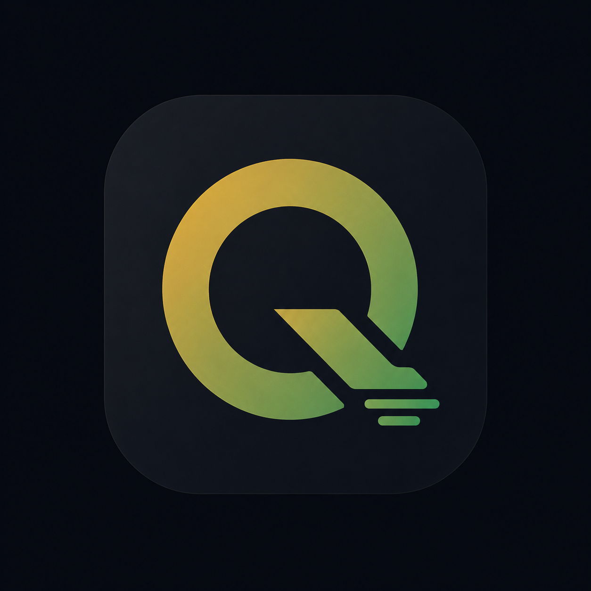

<p align="center">
  <a href="https://www.questxp.in/">
    
  </a>
</p>

<p align="center">
  
</p>

<h1 align="center">QuestXP</h1>

<p align="center">
  <strong>The Future of Hyper-Efficient Learning</strong><br>
  <em>Gamified LMS · AI-Orchestrated Pipelines · Adaptive Scheduling · Cloud-Native on Azure</em>
</p>

<p align="center">
  
  
  
  
  
  
  
</p>

QuestXP is a high-performance Learning Management System engineered to eliminate "Playlist Fatigue." It programmatically transforms unstructured YouTube content — from massive playlists to 10-hour "one-shot" lectures — into structured, modular curricula using an AI-orchestrated background pipeline, Redis-backed job queues, and a pure-JavaScript adaptive scheduling engine.

---

## 🌟 Feature Highlights

| Feature | Description | Implementation |
| :--- | :--- | :--- |
| **AI Course Generation** | YouTube playlist/one-shot → structured course | BullMQ pipeline, YouTube Data API v3, GPT-4o-mini |
| **RAG Doubt Chatbot** | Ask questions grounded in lecture transcripts | Pinecone vector search + OpenAI embeddings |
| **Adaptive Roadmaps** | Personalized schedules that shift with pace | Greedy allocation algo with 75% efficiency factor |
| **Gamification Engine** | XP, levels, streaks, badges, leaderboard | Idempotent XP awards, streak multipliers, Redis rate limiting |
| **Achievement Capture** | TUF-style streak sharing | `html-to-image` + React Portals |
| **Bi-directional Sync** | Player progress ↔ Roadmap, cross-tab | Atomic MongoDB writes + BroadcastChannel API |
| **One-Shot Chapterization** | Timestamp parsing → logical chapters | Description regex + YouTube Data API |
| **Push Notifications** | Firebase Cloud Messaging via backend scheduler | `node-cron` + `firebase-admin` |
| **Structured Logging** | Centralized, clean, and masked observability | `winston`, `morgan`, custom Express middleware |

---

## 🏗️ System Architecture

**Decoupled Monolith with Event-Driven AI Pipeline.**

```
[React Frontend / Vercel]
         │  HTTPS + JWT
         ▼
[Express API / Azure App Service]
  ├── Auth Layer (JWT + Google OAuth)
  ├── Rate Limiter (Redis-backed, per-user + per-IP)
  ├── REST Controllers
  └── BullMQ Job Producers
         │  Redis job queue
         ▼
[BullMQ Workers (same process)]
  ├── courseProcessor  — YouTube API ingestion
  ├── transcriptionWorker — yt-transcript fetch
  ├── embeddingWorker  — OpenAI embeddings → Pinecone
  ├── quizWorker       — GPT quiz generation
  └── notificationWorker — FCM push dispatch

[MongoDB Atlas]  ←→  [Redis (Upstash)]  ←→  [Pinecone]
```

---

## ⚙️ Core Backend Implementations

### 1. Multi-Stage AI Processing Pipeline (BullMQ)

Course creation is fully asynchronous — the API returns instantly while workers process in the background.

**Flow:** `POST /api/courses/generate` → saves stub doc with `status: pending` → pushes job to `course-processing` BullMQ queue → `courseProcessor` worker fetches YouTube metadata → pushes per-lecture jobs to `transcription-processing` queue → `transcriptionWorker` fetches transcripts → `embeddingWorker` chunks text via `@langchain/textsplitters` and upserts vectors to Pinecone (namespaced by `lectureId`) → `quizWorker` generates MCQs via GPT-4o-mini.

- **File:** `backend/src/workers/courseProcessor.js`, `embeddingWorker.js`, `transcriptionWorker.js`
- **Pattern:** Fan-out — one course job fans out to N lecture jobs (N = total lectures)
- **Fault Tolerance:** Failed jobs bubble to BullMQ's failed set; course document status → `error`; no partial ghost courses

### 2. RAG Doubt Chatbot (Pinecone + OpenAI)

Lecture-grounded question answering using Retrieval-Augmented Generation.

- Question is embedded with `text-embedding-3-small`
- Queried against Pinecone namespace (one namespace per lecture) with `topK=5`, minimum cosine score `0.75`
- Context + question assembled into a structured GPT-4o-mini prompt
- Response schema validated via custom AJV schema (`ragAnswerSchema.js`)
- Falls back to general LLM knowledge when score threshold not met — never returns "no answer"
- **File:** `backend/src/services/ragService.js`

### 3. Adaptive Study Plan Algorithm (Pure JS, No AI)

A deterministic scheduling engine in `studyPlanService.js` (~740 lines, zero AI calls).

- **75% Efficiency Factor:** User's stated study time is multiplied by `0.75` to account for note-taking, breaks, and cognitive overhead
- **Greedy Forward-Fill:** Lectures distributed proportionally across available days using a capacity midpoint algorithm — not simple round-robin
- **Feasibility Detection:** If total lecture minutes exceed total available capacity, returns `isFeasible: false` with `pushDeadlineDays` suggestion
- **Daily Recalculation (Idempotent):** On each login, recalculates from today using only incomplete lectures; compares planned vs actual to compute `scheduleStatus: ahead | on_track | behind`
- **File:** `backend/src/services/studyPlanService.js`

### 4. XP Engine with Streak Multipliers (Idempotent Awards)

A transactional gamification system preventing duplicate XP exploits.

- Each award checked against `XPAward` collection within a 24-hour window by `(userId, actionType, resourceId)` — duplicate → returns `{ duplicate: true }` without writing
- XP multiplied by streak tier: `1.0x → 1.25x → 1.5x → 2.0x`
- Level-up computed in the same transaction using `LEVELS` threshold array; unlocked features propagated to user doc atomically
- Badge evaluation runs post-award using current stats snapshot
- **File:** `backend/src/services/xpService.js`

### 5. Redis-Backed Multi-Tier Rate Limiting

Distributed rate limiting stored in Redis, not in-memory (survives restarts).

| Limiter | Window | Max | Key Strategy |
| :--- | :--- | :--- | :--- |
| Global IP | 15 min | 1000 req | Per IP (`rl:global:`) |
| Chatbot Hourly | 1 hr | 3 (L1) / 7 (L2+) | Per `userId`, level-aware |
| Chatbot 2-hr Window | 2 hr | 10 | Per `userId` |
| Quiz Attempts | 12 hr | 5 | Per `userId` |
| Summary Generation | 1 hr | 5 | Per `userId` |

- **Library:** `express-rate-limit` + `rate-limit-redis`
- **File:** `backend/src/middleware/rateLimiter.js`

### 6. Bi-Directional Progress Sync

When a lecture is toggled complete in the Course Player, the backend simultaneously updates the associated Roadmap document — keeping both in sync atomically.

- `toggleLecture` in `progressService.js` finds all Roadmaps containing the `lectureId` and updates `vid.completed` in the same request cycle
- Non-blocking: roadmap sync failure logs but does not fail the primary toggle response
- **File:** `backend/src/services/progressService.js`

### 7. Security Hardening (Production-Grade)

- **Helmet.js:** Sets 15+ security response headers (CSP, HSTS, X-Frame-Options, etc.)
- **HPP:** HTTP Parameter Pollution protection
- **CORS:** Dynamic origin validator — whitelist + wildcard for `*.vercel.app` and `*.questxp.in`; localhost allowed in non-production only
- **JWT:** HttpOnly cookie + `Authorization` header dual-mode; all protected routes require valid JWT via `auth.js` middleware
- **Input Validation:** `express-validator` on all write endpoints; AJV schema validation on AI responses

### 8. Structured Logging & Error Handling

- **Winston + Morgan:** Replaced all `console.log` with structured, prefixed (`[API]`, `[AUTH]`, etc.) Winston loggers. HTTP requests tracked via Morgan middleware.
- **Sensitive Data Redaction:** Custom formatter automatically masks `password`, `token`, and `apiKey` fields before outputting to Azure Log Stream.
- **Centralized Express Error Middleware:** Replaced scattered inline try/catches. Central middleware formats stack traces (in dev) and catches Express-Validator errors. Process-level `unhandledRejection` catchers prevent silent crashes.
- **File:** `backend/src/utils/logger.js`, `backend/src/middleware/errorMiddleware.js`

### 9. Push Notification System (Firebase + node-cron)

- Backend uses `firebase-admin` SDK to send FCM push notifications
- `notificationScheduler.js` runs a `node-cron` job daily to dispatch streak reminders and study nudges
- `notificationWorker.js` processes notification jobs from BullMQ queue
- **File:** `backend/src/workers/notificationWorker.js`, `notificationScheduler.js`

---

## 🚀 Cloud Infrastructure & CI/CD

### Deployment Architecture

| Layer | Platform | Notes |
| :--- | :--- | :--- |
| **Frontend** | Vercel | Auto-deploys from `main` branch |
| **Backend API** | Azure App Service (Linux) | Node.js 22 LTS runtime |
| **Database** | MongoDB Atlas | M0/M2 cluster, TLS |
| **Cache / Queue** | Upstash Redis | Serverless Redis, TLS required |
| **Vectors** | Pinecone | Serverless index, per-lecture namespaces |
| **Push** | Firebase Cloud Messaging | Via `firebase-admin` |

### GitHub Actions CI/CD Pipeline

**File:** `.github/workflows/main_questxp.yml`

```
git push → main branch
       │
       ▼
[GitHub Actions: build job]
  1. Checkout code
  2. Setup Node.js 22.x
  3. cd backend && npm install && npm run build
  4. Upload artifact (backend/ folder)
       │
       ▼
[GitHub Actions: deploy job] (needs: build)
  1. Download artifact
  2. Azure Login (OIDC — no static secrets)
  3. azure/webapps-deploy → QuestXP App Service, Production slot
```

**Authentication:** Uses **OIDC Federated Identity** (not username/password). GitHub requests a short-lived JWT; Azure validates it via a configured Federated Credential. Secrets stored: `AZUREAPPSERVICE_CLIENTID`, `AZUREAPPSERVICE_TENANTID`, `AZUREAPPSERVICE_SUBSCRIPTIONID`.

**Trigger:** Any push to `main` branch automatically kicks off the pipeline. Manual trigger also available via `workflow_dispatch`. Total deploy time: ~2–3 minutes.

---

## ⚛️ Key Frontend Engineering Patterns

### Optimistic UI Updates
Progress toggles update the UI immediately before the server responds. The checkbox state is set locally in the component, and the API call runs in parallel. If the API fails, the state rolls back. This eliminates the ~200–400ms perceived latency on every lecture toggle.

### Cross-Tab Synchronization (BroadcastChannel API)
When a lecture is completed in the Player tab, a `questxp_progress_updated` event is broadcast via the native `BroadcastChannel` API to all other open tabs (Dashboard, Roadmap). Each tab filters by a unique `sourceId` to ignore events it generated itself — preventing double-fetch loops.

### AI Status Polling (`useLectureStatus` hook)
After course creation, lecture AI processing (transcription, quiz, embedding) is async. The `useLectureStatus` custom hook polls `/api/lectures/:id/ai-status` every 3 seconds and stops automatically when all statuses reach `completed | failed`. No unnecessary re-renders after completion.

### Zustand Gamification Store
A lightweight global store (`useGamificationStore`) manages XP, level, streak, toast queue, and level-up modal state. The `applyAward()` action processes the backend's award response, updates XP atomically, queues XP toasts, and triggers the level-up sequence — all without server round-trips. Toast suppression during active video playback prevents UI clutter.

### TanStack Query for Server State
API data (courses, progress, leaderboard) is managed by TanStack Query with configured `staleTime` and cache invalidation. Progress toggles call `queryClient.invalidateQueries()` to surgically refetch only affected data, not the entire app state.

---

## 🛠️ Technical Stack

| Category | Technology |
| :--- | :--- |
| **Runtime** | Node.js v22 LTS |
| **API Framework** | Express.js 4 |
| **Database** | MongoDB Atlas + Mongoose |
| **Cache / Queue Broker** | Redis (Upstash) via ioredis |
| **Job Queues** | BullMQ |
| **AI / LLM** | OpenAI GPT-4o-mini, `text-embedding-3-small` |
| **Vector DB** | Pinecone (serverless) |
| **Text Chunking** | LangChain `@langchain/textsplitters` |
| **YouTube Data** | YouTube Data API v3 + `youtube-transcript` |
| **Auth** | JWT + Google OAuth2 (`google-auth-library`) |
| **Security** | Helmet, HPP, CORS, express-rate-limit |
| **Push Notifications** | Firebase Admin SDK (FCM) |
| **Scheduling** | node-cron |
| **Cloud** | Azure App Service (Backend), Vercel (Frontend) |
| **CI/CD** | GitHub Actions (OIDC → Azure) |
| **Frontend** | React 18 + Vite, Zustand, TanStack Query |

---

## 🚦 Key API Routes

| Endpoint | Method | Description |
| :--- | :--- | :--- |
| `/api/auth/google` | POST | Google OAuth → internal JWT issuance |
| `/api/courses/generate` | POST | Trigger AI course generation pipeline |
| `/api/progress/toggle` | PATCH | Toggle lecture completion + XP award |
| `/api/progress/markAllComplete` | POST | Bulk completion with atomic XP aggregation |
| `/api/plan/generate` | POST | Generate adaptive study plan |
| `/api/doubts/query` | POST | RAG chatbot query against lecture transcript |
| `/api/gamification/profile` | GET | XP, level, streak, badges for current user |
| `/api/gamification/leaderboard` | GET | Global XP leaderboard with percentile rank |
| `/api/roadmap/sync` | POST | Bi-directional Player ↔ Roadmap sync |
| `/api/health` | GET | Health check (no auth required) |


---

## 📄 License

MIT License. Developed by **Parth Patidar**.
